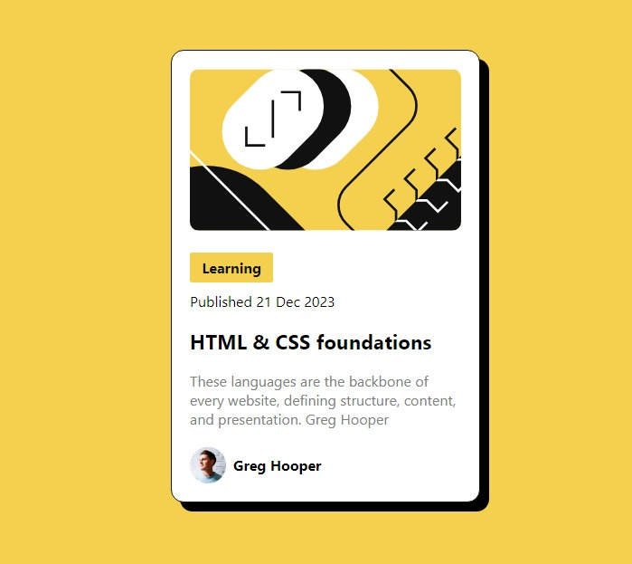

# Frontend Mentor - Blog preview card solution

This is a solution to the [Blog preview card challenge on Frontend Mentor](https://www.frontendmentor.io/challenges/blog-preview-card-ckPaj01IcS). Frontend Mentor challenges help you improve your coding skills by building realistic projects.

## Table of contents

- [Overview](#overview)
  - [The challenge](#the-challenge)
  - [Screenshot](#screenshot)
  - [Links](#links)
  - [Built with](#built-with)
- [Author](#author)

**Note: Delete this note and update the table of contents based on what sections you keep.**

## Overview

### The challenge

Users should be able to:

- See hover and focus states for all interactive elements on the page

### Screenshot

### Links

- Solution URL: [Add solution URL here](https://github.com/ProgrmmingWithNoor/blog-preview-card-main)
- Live Site URL: [Add live site URL here](https://blog-preview-card-html.netlify.app/)

## My process

### Built with

- Semantic HTML5 markup
  --Raw CSS
- CSS custom properties
- Flexbox

If you want more help with writing markdown, we'd recommend checking out [The Markdown Guide](https://www.markdownguide.org/) to learn more.

## Author

- Frontend Mentor - [@N-U-H-WD](https://www.frontendmentor.io/profile/N-U-H-WD)
- Twitter - [@nuhdev](https://twitter.com/nuhdev)
